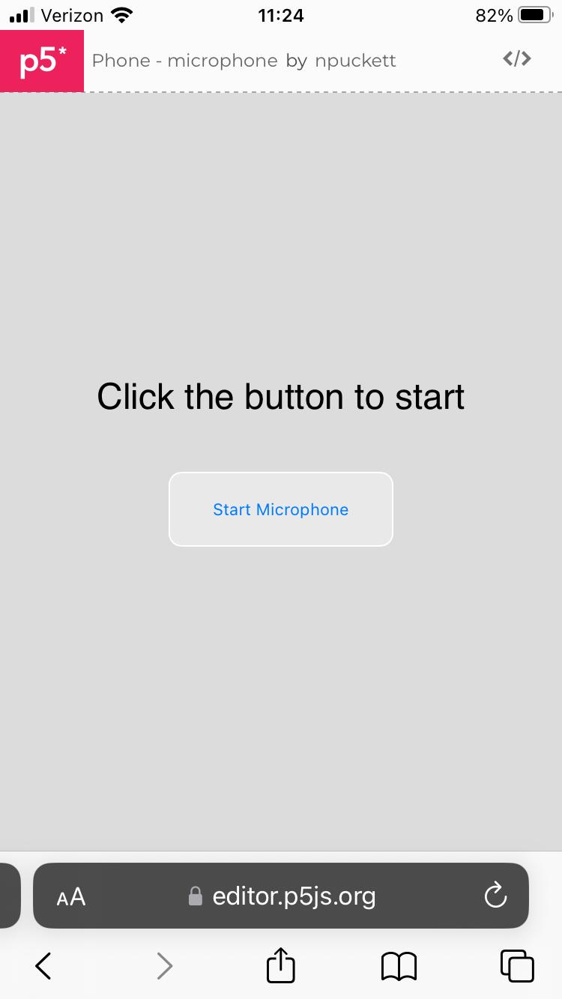
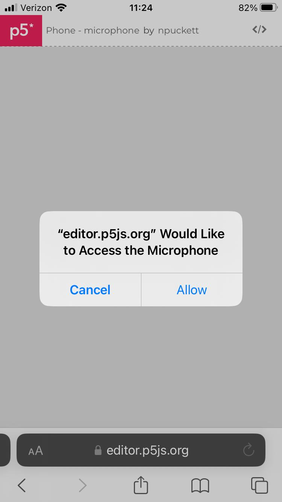
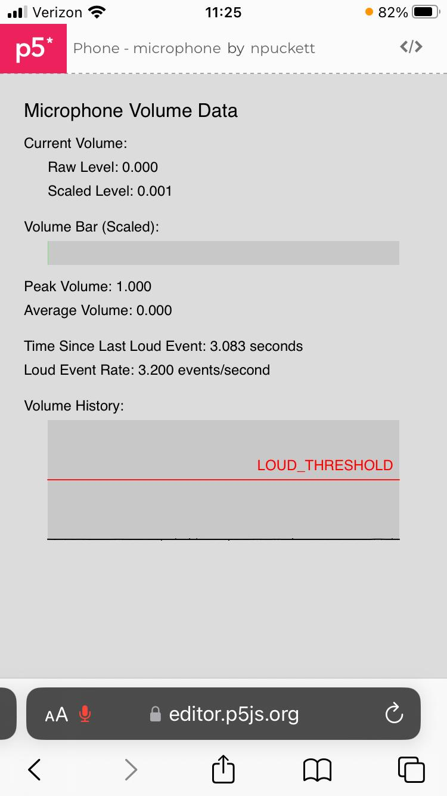
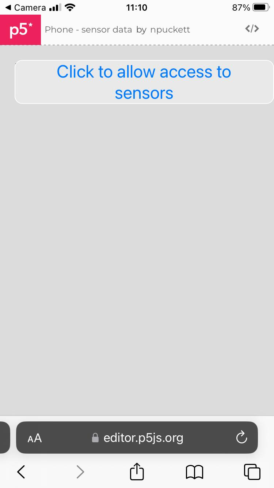
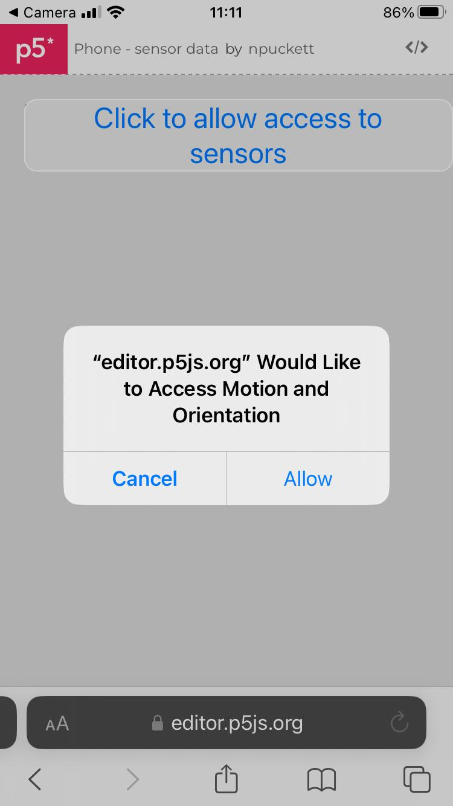
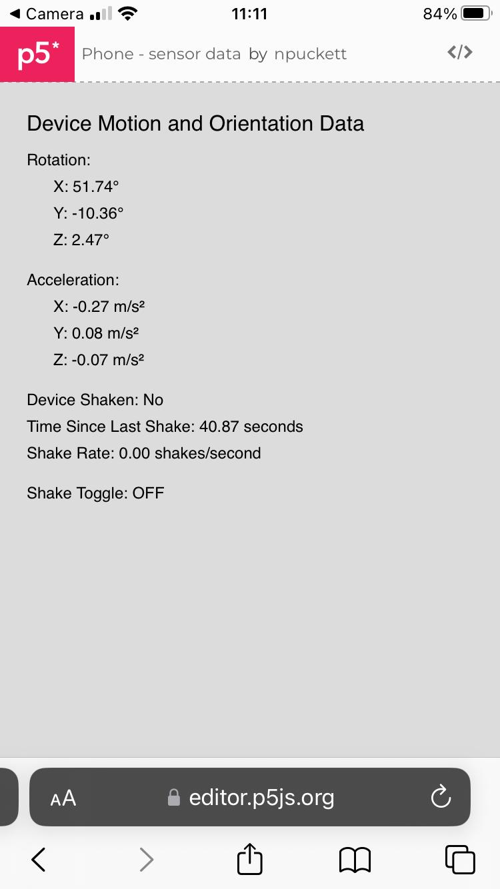

# Enabling Phone Hardware Access in P5.js for IOS
When using **P5 on IOS**, you must directly enable access to hardware inputs. The method for doing this has changed with new versions of the operating system, but these examples have been tested to work with **IOS 18**. 
If running the examples on **Android/Chrome**, no access permissions are required.

## Table of Contents
- [**Enable Microphone Access IOS**](#enable-microphone-access-ios)
- [**Enable Motion Sensor Access IOS**](#enable-motion-sensor-access-ios)

### Enable Microphone Access IOS

**Step 1** : When the page load press **[Start Microphone]** Button | **Step 2** : When the Pop-up comes up click **[Allow]** | You should now see the data from the microphone. *Note Noise cancellation makes them each behave differently
:--- | :--- | :---
 |  | 

### Enable Motion Sensor Access IOS

**Step 1** : click **[Click to allow access to sensors]** Button | **Step 2** : When the pop-up comes up, click **[Allow]** | You should now see the data from the motion sensors
:--- | :--- | :---
 |  | 